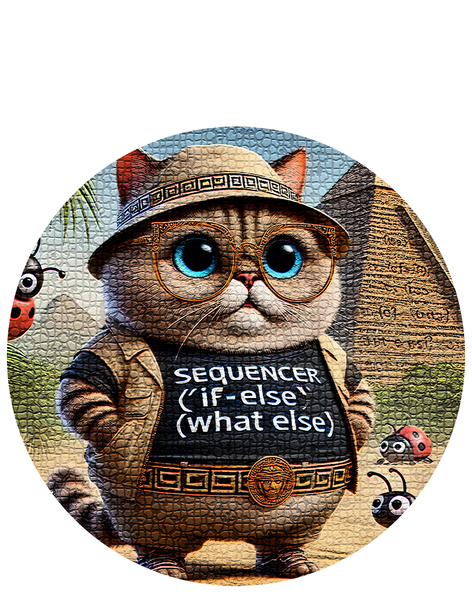

Sequencer is a `Swift` library designed to manage the execution of blocks of code (`SequenceAction`), using an easy-to-use dot syntax style API to build complex chains, making it ideal for building step-based animations or workflows.

  

It has been designed to be easily extendable and customizable.

  

You can add custom actions, animations, or even new chaining methods by extending `Sequencer` or creating new `SequenceAction` types.

  

- ****Supports****:

- Swift 5.9

- ****Platforms****:

- macOS 10.15+

- iOS 16+

- tvOS 13+

- watchOS 7+

  

## Installation

  

To install the Sequencer package, add the following to your `Package.swift`:

  

```swift

dependencies: [
.package(url: "https://github.com/BlackMirrorz/Sequencer", from: "1.0.0")
]

```

Then, import `Sequencer` anywhere you'd like to use it:

  
```swift

import Sequencer

```


## Usage


### Creating a Sequencer Instance

To create a `Sequencer` instance is as a simple as:

  

```swift

let sequencer = Sequencer()

```

### Chaining Actions

`Sequencer` provides several default actions that can be chained together:

- ****run****: Executes a block of code immediately.

- ****animate****: Executes an animation with a specified duration, speed and repeat count or global configuration.

- ****pause****: Pauses the sequence for a given duration.

- ****delayFor****: Delays execution of a block of code for a specified duration.

- ****perform****: Adds a custom `SequenceAction` to the sequence, allowing for complex or specific actions that implement the `SequenceAction` protocol.

- ****repeat****: Repeats an action based on the number of iterations required.

- ****loop****: Loops the entire sequence based on the number of iterations required.

#### Example Usage


```swift

Sequencer()
.run { print("Starting sequence") }
.animate(.linear(duration: 0.5, speed: 1.0, repeatCount: 1)) {
// Perform animated changes here
}
.pause(1.0)
.run { print("Sequence paused and resumed") }
.start()

```

### Global Configuration

Global configuration simplifies animation management by allowing you to set a default AnimationConfiguration for actions.

Setting Global Configuration:

```swift
sequencer.setGlobalConfiguration(.easeIn(duration: 0.3))
```

This configuration is automatically applied to animate and delayFor actions if no explicit configuration is provided.

Example with Global and Explicit Configurations:

```swift
sequencer
    .setGlobalConfiguration(.easeIn(duration: 0.3))
    .animate {
        print("Using global configuration")
    }
    .animate(.spring(response: 0.5, dampingFraction: 0.8, blendDuration: 0.1)) {
        print("Using explicit configuration")
    }
    .start()
```

Applying A Configuration to All Actions:

The `applyToAll` method updates the animation configuration for all applicable actions in the sequence.

Example:

```swift
sequencer
    .setGlobalConfiguration(.linear(duration: 0.3))
    .animate {
        print("Global configuration")
    }
    .applyToAll(.easeOut(duration: 0.5))
    .start()
```
In this example, the .easeOut configuration will overwrite all configurations in the sequence.

### AnimationConfiguration

The `Sequencer` supports animations using `AnimationConfiguration`, a struct that encapsulates the animation style, duration, speed, and repeat count, making it easy to configure animations with specific timing and effects within your sequences


By default, `Sequencer` provides several animation types for convenience:

  
**`linear`**: A linear animation over a specified duration. Use this for steady, consistent animations without acceleration or deceleration.

```swift

sequencer.animate(.linear(duration: 0.5, speed: 1.0, repeatCount: 1)) {
    // Perform linear animated changes here
}

```

**`easeIn`**: An animation that starts slowly and accelerates. This is ideal for actions that need to build up momentum.

```swift

sequencer.animate(.easeIn(duration: 0.5, speed: 1.0, repeatCount: 1)) {
    // Perform ease-in animated changes here
}
``` 

**`easeOut`**: An animation that decelerates towards the end, providing a smooth finish. Useful for actions that should end gradually.

```swift

sequencer.animate(.easeIn(duration: 0.5, speed: 1.0, repeatCount: 1)) {
    // Perform ease-in animated changes here
}
```

**`easeInEaseOut`**:  An animation that starts slowly, accelerates in the middle, and slows down at the end. Ideal for smooth, organic movements.
```swift

sequencer.animate(.easeIn(duration: 0.5, speed: 1.0, repeatCount: 1)) {
    // Perform ease-in animated changes here
}
```

**`spring`**:  A spring-like animation with configurable response and damping. It has a natural, bouncing effect suitable for playful or elastic movements.
```swift

sequencer.animate(.easeIn(duration: 0.5, speed: 1.0, repeatCount: 1)) {
    // Perform ease-in animated changes here
}
```

**`bouncy`**: A bouncy animation with a specified duration that can be used for playful effects. It has a gentle bounce at the end.
```swift

sequencer.animate(.bouncy(duration: 0.5, speed: 1.0, repeatCount: 1)) {
    // Perform bouncy animation changes here
}
```

Each `AnimationConfiguration` includes a `verboseDescription` that details the animation’s properties, including duration, speed, and repeat count. This is useful for debugging and logging, providing transparency about the animation configuration used in each sequence step

### Block Actions

Block actions allow you to group actions together and apply logic like repeating or looping within the block.

Use the `.runBlock` method to define grouped actions:

- ****run****: Executes a block of code immediately.

- ****animate****: Executes an animation with a specified duration, speed and repeat count or global configuration.

- ****pause****: Pauses the sequence for a given duration.

- ****delayFor****: Delays execution of a block of code for a specified duration.

- ****perform****: Adds a custom `SequenceAction` to the sequence.

- ****repeat****: Repeats an action based on the number of iterations required.

- ****loop****: Loops the entire sequence based on the number of iterations required.

Note that you cannot currently apply a globalConfiguration within the `.runBlock` itself.

Example Basic Block

```swift
sequencer
    .run { print("Outer: Before block") }
    .runBlock { block in
        block.run { print("Inner: Step 1") }
        block.run { print("Inner: Step 2") }
        block.run { print("Inner: Step 3") }
    }
    .run { print("Outer: After block") }
    .start()
```

Example Repeating Block

```swift
sequencer
    .runBlock { block in
        block.run { print("Inner: Step 1") }
        block.run { print("Inner: Step 2") }
        block.repeat(times: 2)
    }
    .start()
```

Example Looping Block Actions

```swift
sequencer
    .runBlock { block in
        block.run { print("Inner: Step 1") }
        block.run { print("Inner: Step 2") }
        block.loop(times: 3)
    }
    .start()
```

### Repitition Of An Action

The `repeat(times:)` function allows you to repeat the last action in the sequence a specified number of times.

Example:

```swift

let sequencer = Sequencer()

sequencer
.delayFor(2) { print("Action executed") }
.repeat(times: 5)
.start()

```

### Action Completion Handling
With `Sequencer`, you can execute a custom closure after each action completes, using `onActionCompletion`. This is useful for tracking the progress of each action in the sequence or performing additional tasks as each action finishes.

Example:

```swift
let sequencer = Sequencer()

sequencer
    .run { print("Starting sequence") }
    .onActionCompletion { print("An action just completed") }
    .animate(.linear(duration: 0.5)) { print("Step 2: Linear animation") }
    .onActionCompletion { print("Animation action completed") }
    .pause(0.5)
    .start()
```

### Looping The Sequence

The `loop(times:)` function repeats the entire sequence a specified number of times. This includes all actions added to the sequence before the loop(times:) method is invoked.

Example;

```swift
let sequencer = Sequencer()

sequencer
    .run { print("Starting loop sequence") }
    .animate(.easeIn(duration: 0.5)) { print("Step 1: Animation") }
    .pause(1.0)
    .run { print("Step 2: Running some code") }
    .loop(times: 3)
    .completion { print("Sequence completed") }
    .start()
```
Explanation:

The actions (run, animate, pause, and another run) are executed in sequence.
The entire sequence is repeated 3 times because of the loop(times: 3) method.
After 3 loops, the completion handler executes.


## Extending Sequencer

### Adding Custom Actions

To add a custom action to the sequence, create a new struct that conforms to `SequenceAction`. Define what this action should do by implementing the `execute` method.

Example:

```swift
struct UselessAction: SequenceAction {
    let message: String
    
    var verboseDescription: String {
        "Custom log action with message: \(message)"
    }
    
    func execute(completion: @escaping () -> Void) {
        print(message)
        completion()
    }
}

// Using the custom action with `Sequencer`
let sequencer = Sequencer()
sequencer
    .perform(UselessAction(message: "Custom log entry"))
    .start()
```

### Adding Custom Animations

To create custom animations, define a new initializer in `AnimationConfiguration` or a custom struct encapsulating the animation’s behavior and duration.

Example:

```swift

extension AnimationConfiguration {

  static func customBounce(duration: Double) -> AnimationConfiguration {
    return AnimationConfiguration(
      animation: .interpolatingSpring(stiffness: 200, damping: 5),
      duration: duration,
      verboseDescription: "Custom Bounce Animation"
    )
  }
}

sequencer.animate(.customBounce(duration: 0.5)) {
    // Perform custom bounce animation changes here
}
```
  
### Debugging a Sequencer Instance

If you want to debug the actions via the console you can use:

```swift

let sequencer = Sequencer()

sequencer.debug()

```

### Cancelling a Sequencer Instance
If you wish to cancel the `Sequencer` ensure that you have made it a global variable and then simply call cancel as needed:

  
```swift

let sequencer = Sequencer()
sequencer.run { print("foo")
sequencer.start()
sequencer.cancel()

```

### Sequencer in Action
A basic example using  `Sequencer` can be found in the Demo Project.


